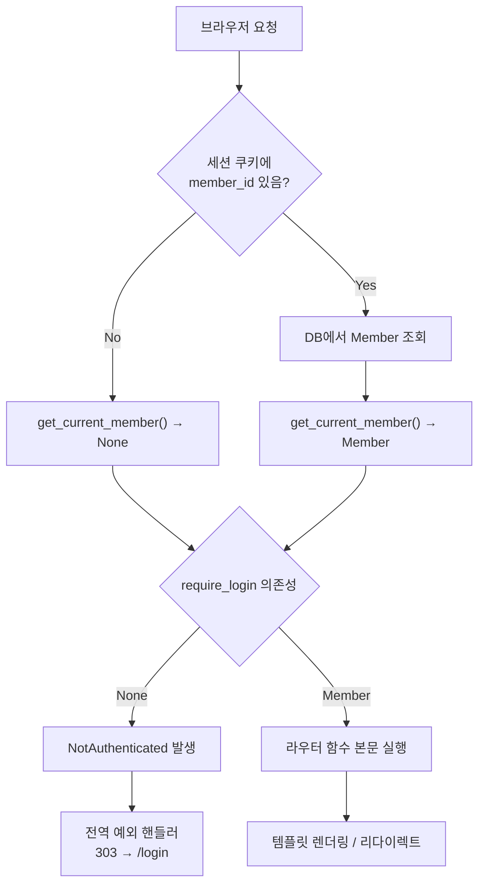
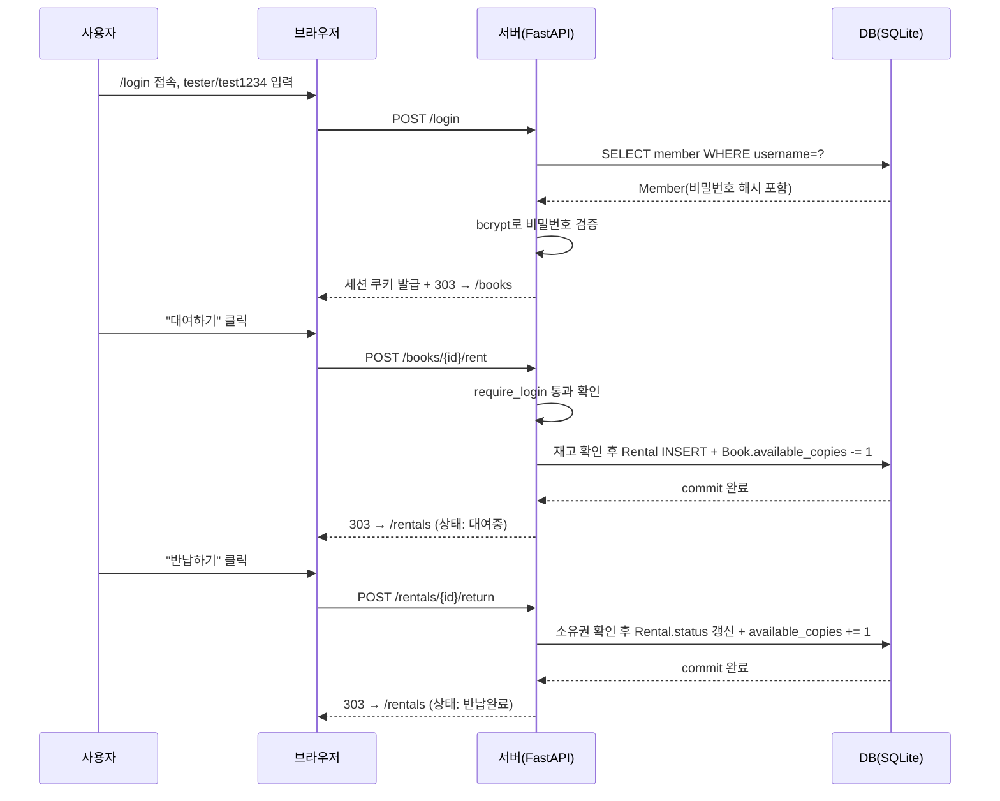
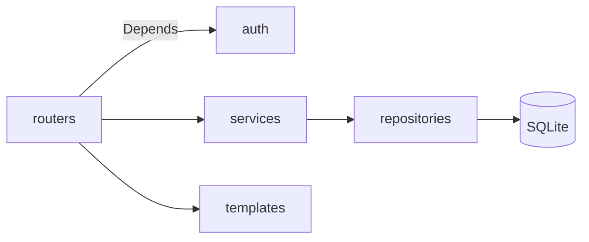
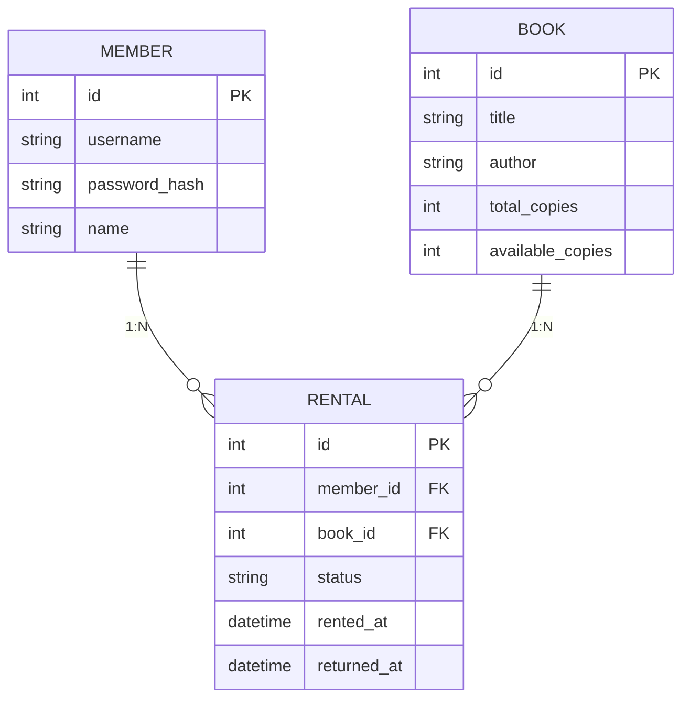

# b5-3 도서 대여 서비스 — 인증/인가 + 연관관계 확장

FastAPI + SQLAlchemy + Jinja2 SSR 기반 도서 대여 서비스. b5-2(단일 모델 CRUD)를 확장해
로그인/로그아웃(세션 기반 인증), 보호 라우트, 3개 모델의 연관관계, 상태가 바뀌는
핵심 비즈니스 로직(대여 → 반납)을 통합했다.

## 개발 환경

| 항목 | 버전 |
|---|---|
| Python | 3.12 (요구사항: 3.10 이상) |
| fastapi | 0.115.6 |
| uvicorn | 0.32.1 |
| sqlalchemy | 2.0.36 |
| jinja2 | 3.1.4 |
| python-multipart | 0.0.19 |
| itsdangerous | 2.2.0 |
| passlib | 1.7.4 |
| bcrypt | 4.0.1 |

## 실행 방법

```bash
python3 -m venv .venv
source .venv/bin/activate
pip install -r requirements.txt

uvicorn app.main:app --reload
```

`http://localhost:8000` 접속. 최초 실행 시 테스트 계정 1명과 샘플 도서 3권이 자동으로 채워진다
(`app/main.py`의 `seed()`). DB 파일은 프로젝트 루트의 `database.db` (SQLite).

### 환경변수

| 변수 | 필수 | 기본값 | 설명 |
|---|---|---|---|
| `SESSION_SECRET_KEY` | 운영 환경에서는 필수 | `dev-secret-change-in-production` | `SessionMiddleware`가 세션 쿠키를 서명(itsdangerous)하는 데 쓰는 키. 이 값이 새어 나가면 누구나 임의의 `member_id`로 세션 쿠키를 위조할 수 있다 |
| `SESSION_MAX_AGE` | 아니오 | `7200`(2시간, 초 단위) | 세션 쿠키 만료 시간. 로그인 후 이 시간이 지나면 서버 재시작 없이도 세션이 무효화된다 |
| `SESSION_HTTPS_ONLY` | 아니오 | `false` | `true`로 설정하면 세션 쿠키에 `Secure` 속성이 붙어 HTTPS 연결에서만 전송된다(배포 시 필수) |

로컬 실행 예시:

```bash
export SESSION_SECRET_KEY="$(python -c 'import secrets; print(secrets.token_hex(32))')"
uvicorn app.main:app --reload
```

`app/main.py`는 `os.environ.get("SESSION_SECRET_KEY", "dev-secret-change-in-production")`로 값을
읽는다(코드 상 `# ponytail: 데모용 기본값. 실서비스라면 반드시 환경변수로만 주입해야 한다` 주석
참고). 기본값은 로컬 데모 편의를 위한 것이고, 배포 시에는 반드시 환경변수(또는 시크릿 매니저)로
덮어써야 한다 — 기본값을 그대로 배포하면 세션 위조가 가능해진다. `SESSION_SECRET_KEY`를 지정하지
않고 실행하면 서버 기동 시 `RuntimeWarning`이 출력되어 기본값 사용 중임을 바로 알 수 있다.

## 테스트 계정

| 항목 | 값 |
|---|---|
| 아이디 | `tester` |
| 비밀번호 | `test1234` |
| 저장 방식 | DB 저장 (`members` 테이블, bcrypt 해시) |

로그인 화면과 도메인의 "회원"을 분리하지 않고 `Member` 모델 하나로 겸했다 — 이 규모의
앱에서 인증 계정과 도메인 회원을 별도 테이블로 나눌 이유가 없어서다.

## 공개/보호 경로 정책

| 경로 | 구분 | 설명 |
|---|---|---|
| `GET /` | 공개 | 홈. 로그인 여부에 따라 문구/링크만 달라짐 |
| `GET /login`, `POST /login` | 공개 | 로그인 폼 및 처리 |
| `POST /logout` | 공개 | 로그아웃(세션 초기화) |
| `GET /books` | **보호** | 도서 목록 |
| `GET /books/{id}` | **보호** | 도서 상세 |
| `POST /books/{id}/rent` | **보호** | 대여(상태 변경) |
| `GET /rentals` | **보호** | 내 대여 목록 |
| `POST /rentals/{id}/return` | **보호** | 반납(상태 변경) |

보호 라우트는 `Depends(require_login)`을 의존성으로 걸어 표시한다(`app/auth/dependencies.py`).
비로그인 상태로 보호 라우트에 접근하면 `NotAuthenticated` 예외가 발생하고, `app/main.py`에
등록된 전역 예외 핸들러가 `303 See Other`로 `/login`으로 리다이렉트한다.

### 인증/인가 흐름 (Depends 체인)

`get_current_member`(세션 조회, 실패해도 `None`)와 `require_login`(없으면 예외)을 분리해
"선택적 로그인 확인"과 "필수 로그인 확인"을 나눈 이유는 공개 페이지(`/`)에서도 로그인 여부에
따라 문구만 바꾸고 싶어서다. 하나로 합쳤다면 공개 페이지조차 강제로 `/login`으로 튕겨 나간다.



인가 실패(`NotAuthenticated`)가 라우터 코드가 아니라 FastAPI의 의존성 해석 단계에서 먼저
발생하므로, 보호 라우트가 늘어나도 각 라우터는 `Depends(require_login)` 한 줄만 추가하면 되고
"차단됐을 때 어디로 보낼지"는 `app/main.py`의 예외 핸들러 한 곳만 고치면 된다.

### 로그인 → 대여 → 반납 시퀀스



### 리다이렉트 안내 메시지 (플래시 메시지)

비로그인 접근 시 `/login`으로 303 리다이렉트되면서 "왜 로그인 화면으로 왔는지"를 알려주는
1회성 플래시 메시지가 함께 표시된다. 별도 라이브러리 없이 이미 붙어 있는
`SessionMiddleware`의 세션에 메시지를 실어 보내는 방식으로 구현했다(`app/main.py`,
`app/routers/pages.py`):

```python
# app/main.py — NotAuthenticated 예외 핸들러에서 세션에 플래시를 심는다
@app.exception_handler(NotAuthenticated)
async def handle_not_authenticated(request: Request, exc: NotAuthenticated):
    request.session["flash"] = "로그인이 필요한 기능입니다."
    return RedirectResponse(url="/login", status_code=303)

# app/routers/pages.py — login_form이 꺼내고 즉시 지운다(1회성)
@router.get("/login")
def login_form(request: Request):
    flash = request.session.pop("flash", None)
    return templates.TemplateResponse("login.html", {"request": request, "error": flash})
```

`session.pop`으로 꺼내는 순간 세션에서 지워지므로 새로고침해도 메시지가 반복 노출되지 않는다
(`test_app.py`의 1-1/1-2 단계가 "한 번 뜨고 다음엔 사라짐"을 검증한다).

### 권한(역할) 기반 접근 제어 확장 지점

지금은 "로그인 여부"만 검사하는 이진 인가(`require_login`)뿐이고 역할(role)별 접근 제어는
없다 — 이 앱에 관리자/일반 회원 구분 자체가 없기 때문이다. 나중에 역할이 필요해지면
`require_login`과 같은 자리에 새 의존성을 추가해 체인을 확장하면 된다:

```python
def require_role(role: str):
    def checker(member: Member = Depends(require_login)) -> Member:
        if member.role != role:
            raise NotAuthorized()  # 403 처리용 별도 예외
        return member
    return checker

# 사용:
@router.get("/admin")
def admin_page(member: Member = Depends(require_role("admin"))): ...
```

`require_login`을 감싸는 형태로 만들면 "로그인 확인"과 "역할 확인"이 분리된 채로 재사용된다.
이 앱엔 관리자 화면이나 역할 컬럼 자체가 없어 실제로 구현하지는 않았다 — 쓰이지 않는 역할
분기를 미리 만들어두는 건 검증할 방법이 없는 코드를 늘리는 것뿐이라, 필요해지는 시점에
위 스케치대로 추가하는 쪽을 택했다(YAGNI).

### 중앙 인가 미들웨어 대신 Depends를 고른 이유

세션 발급 자체는 앱 전체에 적용되는 관심사라 `SessionMiddleware`(전역)로 두고, "이 라우트가
로그인을 요구하는가"는 라우트마다 다른 관심사라 `Depends(require_login)`(라우트별 명시적 선언)로
뒀다 — 책임 소재를 요청 처리 계층에 맞게 나눈 것이다. 전역 차단 미들웨어(예: 경로 프리픽스
화이트리스트로 `/login`, `/`, `/logout`만 통과시키고 나머지는 차단)로 대체할 수도 있지만, 그러면
"이 라우트는 보호 대상인가"를 라우터 파일이 아니라 미들웨어 설정에서 찾아야 해서 새 라우트를
추가할 때 두 곳(라우터 + 미들웨어 화이트리스트)을 같이 신경 써야 한다. 지금처럼 보호 라우트
개수가 적을 때는 `Depends`가 "여기서 바로 보인다"는 이점이 더 크고, 라우트가 수십 개로
늘어나 화이트리스트 방식이 더 안전(deny-by-default)해지는 시점이 오면 미들웨어 도입을
재검토할 만하다.

## 주요 기능 경로

| 기능 | 경로 |
|---|---|
| 도서 목록/재고 확인 | `GET /books` |
| 도서 상세 + 대여하기 | `GET /books/{id}`, `POST /books/{id}/rent` |
| 내 대여 목록 + 반납하기 | `GET /rentals`, `POST /rentals/{id}/return` |

## 인증 방식 선택 사유

**방식 A(세션 기반)** 선택. `starlette.middleware.sessions.SessionMiddleware`가 로그인 성공 시
`request.session["member_id"]`를 서명된(itsdangerous) 쿠키에 저장하고, 이후 요청마다
`get_current_member` 의존성이 이를 읽어 DB에서 회원을 조회한다. JWT는 토큰 재발급/만료/저장 위치
(localStorage vs 쿠키) 등 신경 쓸 게 늘어나는데, 이 앱은 SSR 단일 서버 구조라 서버가 세션 상태를
직접 들고 있는 편이 훨씬 단순하고 정확하다 — SPA/모바일 클라이언트가 따로 붙는 구조가 아니면
JWT를 쓸 이유가 없다.

## 세션 만료, 쿠키 보안, CSRF

`app/main.py`의 `SessionMiddleware` 등록에 만료·보안 옵션을 명시했다:

```python
app.add_middleware(
    SessionMiddleware,
    secret_key=SECRET_KEY,
    max_age=int(os.environ.get("SESSION_MAX_AGE", 60 * 60 * 2)),  # 기본 2시간 후 만료
    https_only=os.environ.get("SESSION_HTTPS_ONLY", "false").lower() == "true",
    same_site="lax",
)
```

- **만료**: `max_age`(기본 2시간, `SESSION_MAX_AGE`로 조정 가능)를 지정하지 않으면 브라우저 세션
  쿠키(브라우저를 닫을 때까지 유지, 서버 쪽 강제 만료 없음)로 동작한다. 매 요청마다
  `request.session`이 갱신되며 쿠키가 재발급되는 `SessionMiddleware`의 동작 덕분에, 활동이 있을
  때마다 만료 시각이 밀리는 sliding expiration으로 동작한다.
- **쿠키 보안 옵션**: `httponly`는 `SessionMiddleware`가 항상 켜둔다(JS에서 쿠키를 읽을 수 없음,
  XSS로 세션 탈취를 어렵게 함). `https_only`(Secure 속성)는 `SESSION_HTTPS_ONLY=true`로 켜면 된다
  — 로컬 HTTP 개발 편의를 위해 기본값은 꺼져 있으므로, 배포 시 반드시 켜야 평문 HTTP로 쿠키가
  새는 것을 막는다.
- **CSRF**: 상태 변경 엔드포인트(`POST /books/{id}/rent`, `POST /rentals/{id}/return`,
  `POST /logout`)는 세션 쿠키만으로 요청을 신뢰하면 CSRF에 노출된다(공격자 페이지의 자동 제출
  폼이 로그인된 사용자의 쿠키를 실어 이 엔드포인트를 호출할 수 있음). 새 라이브러리 없이
  synchronizer token 패턴으로 직접 구현했다(`app/auth/dependencies.py`):

  ```python
  def get_or_create_csrf_token(request: Request) -> str:
      token = request.session.get("csrf_token")
      if token is None:
          token = secrets.token_urlsafe(32)
          request.session["csrf_token"] = token
      return token

  def verify_csrf(request: Request, csrf_token: str = Form(...)) -> None:
      expected = request.session.get("csrf_token")
      if not expected or not secrets.compare_digest(csrf_token, expected):
          raise CSRFError()
  ```

  `get_or_create_csrf_token`은 각 라우터의 `Jinja2Templates` 인스턴스에
  `templates.env.globals["csrf_token"] = get_or_create_csrf_token`로 전역 등록해, 템플릿에서
  `{{ csrf_token(request) }}`로 세션당 1개의 토큰을 만들어 hidden input에 심는다
  (`base.html`의 로그아웃 폼, `book_detail.html`의 대여 폼, `my_rentals.html`의 반납 폼).
  `verify_csrf`는 세 개의 상태 변경 POST 라우트에 `dependencies=[Depends(verify_csrf)]`로
  걸려 있고, 토큰이 없거나 세션 값과 다르면 `CSRFError` → `app/main.py`의 핸들러가 403으로
  응답한다. `same_site="lax"`가 다른 사이트發 단순 폼 전송을 1차로 막고, CSRF 토큰이 그
  뒤를 받쳐주는 이중 방어 구조다. `test_app.py`가 "틀린 토큰으로 대여 요청 → 403"을 검증한다.

## 폴더 구조

```
app/
├── main.py                  # 앱 조립: 미들웨어, 라우터 등록, 전역 예외 핸들러, seed
├── database.py               # engine / SessionLocal / get_db
├── errors.py                  # DomainNotFound (404 처리용)
├── models/                    # SQLAlchemy ORM 모델 (Member, Book, Rental)
├── auth/dependencies.py      # 인증/인가: get_current_member, require_login
├── repositories/               # DB 접근 (책/대여/회원)
├── services/                   # 비즈니스 로직 (로그인 인증, 대여/반납)
├── routers/                    # 요청/응답 (pages, books, rentals)
└── templates/                  # Jinja2 템플릿
```

### 레이어 구조 (요청이 흐르는 순서)



라우터는 요청을 해석하고 응답 형식(리다이렉트/템플릿)만 고른다. 인증 여부는 `Depends`로 auth
모듈에, 비즈니스 규칙(재고 확인·상태 전이·소유권 검증)은 services에, DB 접근은 repositories에만
위임한다. 이 분리 덕분에 "화면만 바꾼다" 같은 변경은 templates/routers만, "정책을 바꾼다"
(예: 1인당 최대 대여 3권)는 services만 건드리면 된다 — 어느 파일을 열어야 할지 요청의 성격만
보고도 예측할 수 있다는 게 이 구조의 실질적 이득이다.

### 서비스 ↔ 레포지토리 경계

레포지토리는 "DB 접근"만 하고 비즈니스 판단은 하지 않는다. 두 계층의 함수 시그니처(타입 힌트)로
경계가 드러난다:

```python
# repositories/book_repository.py — DB 조회만, 예외는 "없음"만 판단
def get_all(db: Session) -> List[Book]: ...
def get_or_404(db: Session, book_id: int) -> Book: ...   # 없으면 DomainNotFound

# repositories/rental_repository.py
def get_by_member(db: Session, member_id: int) -> List[Rental]: ...
def get_or_404(db: Session, rental_id: int) -> Rental: ...

# services/rental_service.py — Session과 도메인 객체를 받아 비즈니스 규칙을 적용
def rent_book(db: Session, member: Member, book_id: int) -> Rental: ...
def return_book(db: Session, member: Member, rental_id: int) -> Rental: ...
```

서비스 함수는 항상 `(db: Session, ...도메인 파라미터...) -> 도메인 모델`을 반환한다. 레포지토리는
"찾았다/못 찾았다"만 판단(`get_or_404`)하고, "이 재고로 대여해도 되는가", "이 대여 기록이 내
것인가" 같은 판단은 전부 서비스에 있다 — 레포지토리를 다른 저장소 구현(예: 다른 DB)으로
바꿔도 서비스의 비즈니스 로직은 그대로 유지되는 게 이 경계의 목적이다.

## 도메인 모델 및 연관관계



- `Member` 1 : N `Rental` (양방향, `back_populates`)
- `Book` 1 : N `Rental` (양방향, `back_populates`)
- `Rental.status`: `대여중` → `반납완료` (상태 변경 비즈니스 로직의 핵심)

`Rental`을 "회원이 어떤 책을 언제 빌렸는가"를 나타내는 독립 테이블로 두고 양쪽에서
`relationship`으로 참조했다. `Member`나 `Book`에 콤마로 구분한 ID 문자열 컬럼을 두는 방식도
가능하지만, 그러면 조회할 때마다 파싱해야 하고 무결성(FK)도 보장할 수 없다. `back_populates`는
관계의 양쪽(`member.rentals` ↔ `rental.member`, `book.rentals` ↔ `rental.book`)을 서로 명시적으로
연결해줘서, `rental.book.available_copies -= 1`처럼 객체 그래프를 그대로 따라가는 코드
(`rental_service.py`)를 쓸 수 있게 해준다.

cascade 정책: `Book.rentals`는 `cascade="all, delete-orphan"` — 책 레코드가 삭제되면 그 책에 대한
대여 기록도 의미가 없으므로 함께 삭제한다. 반면 `Member.rentals`는 cascade를 걸지 않았다 — 회원이
삭제되어도 "누가 언제 무엇을 빌렸는지"는 감사 기록으로 남아야 한다는 판단이다(이유는
`app/models/member.py`, `app/models/book.py`에 주석으로도 남겨두었다). 이 정책은
`test_app.py::test_cascade_delete`가 검증한다 — 임시 책을 만들고 그 책의 `Rental`을 하나 붙인 뒤
책을 삭제하고, `db.query(Rental).filter(Rental.book_id == book.id).count() == 0`을 단언한다
(회원 삭제 기능 자체가 이 앱에 없으므로 `Member` 쪽 cascade-없음은 코드 리뷰로만 확인 가능).

### 관계 로딩 전략 (lazy vs eager)

`relationship()`에 `lazy` 옵션을 지정하지 않았으므로 SQLAlchemy 기본값인 `"select"`(지연 로딩)로
동작한다 — `rental.book`에 처음 접근하는 순간 별도 SELECT 쿼리가 나간다. 이 앱 규모(도서 3권,
회원 1명)에서는 문제가 되지 않지만, `my_rentals.html`처럼 `` 루프 안에서
`rental.book.title`을 매번 참조하면 N+1 쿼리(대여 건수만큼 추가 SELECT)가 발생한다. 대여 목록이
커지면 `rental_repository.get_by_member`에서 `joinedload(Rental.book)` 또는
`selectinload(Rental.book)`을 걸어 한 번의 쿼리(또는 IN 쿼리 1회)로 미리 가져오는 편이 낫다.

### 순환참조와 직렬화

`Member.rentals` ↔ `Rental.member`, `Book.rentals` ↔ `Rental.book`은 모두 양방향
`relationship`이라 파이썬 객체 그래프 상으로는 순환 참조다(`member.rentals[0].member`가 다시
원래 `member`를 가리킨다). 이 앱은 **Jinja2 SSR만 쓰고 JSON API가 없어서** 실질적인 문제가
되지 않는다 — 템플릿은 `rental.book.title`처럼 필요한 속성 하나만 짚어서 읽지, 객체 전체를
재귀적으로 직렬화하지 않기 때문이다.

다만 이후 이 프로젝트에 JSON API(Pydantic 응답 모델)를 얹는다면 주의가 필요하다.
`Rental` ORM 객체를 그대로(`jsonable_encoder`나 `model_validate`로 관계 필드까지 포함해서)
직렬화하면 `member` → `rentals` → `member` → `rentals` → ... 로 무한 재귀에 빠지거나, 최소한
불필요하게 큰 응답이 만들어진다. 대응 전략은 두 가지다.

1. **응답 스키마에서 역참조를 빼고 얕게(shallow) 만든다** — 가장 간단하고 권장하는 방법.

   ```python
   class RentalOut(BaseModel):
       model_config = ConfigDict(from_attributes=True)
       id: int
       status: str
       rented_at: datetime
       book_title: str  # book 전체가 아니라 필요한 필드만 평탄화

       @classmethod
       def from_orm_rental(cls, rental: Rental) -> "RentalOut":
           return cls(id=rental.id, status=rental.status,
                       rented_at=rental.rented_at, book_title=rental.book.title)
   ```

2. **양방향 relationship 자체를 스키마에 노출하지 않는다** — `MemberOut`에는 `rentals: list[RentalOut]`을
   두더라도, `RentalOut` 안에는 다시 `member`를 넣지 않는 식으로 한쪽 방향만 직렬화 그래프에
   포함시켜 순환을 원천 차단한다.

지금은 API가 없어 실제로 겪는 문제는 아니지만, 이 프로젝트에 `GET /api/rentals` 같은 JSON
엔드포인트가 추가되는 순간 바로 부딪히게 될 이슈라 미리 문서화해 둔다.

### 모델 설명

세 모델 모두 클래스 docstring으로 "이 테이블이 왜 존재하는지"를 남겼다(`Member`: "로그인 계정 +
대여 서비스 이용자를 겸하는 모델", `Book`: "대여 대상 도서 한 종", `Rental`: "회원(N:1) +
도서(N:1)를 잇는 관계 모델"). `__repr__`도 세 모델에 모두 추가해 디버깅 콘솔이나 로그에서
객체를 바로 식별할 수 있게 했다:

```python
>>> book
<Book id=3 title='1984' available=0/1>
>>> rental
<Rental id=5 book_id=3 member_id=1 status='대여중'>
>>> member
<Member id=1 username='tester'>
```

비밀번호 해시(`password_hash`)는 `Member.__repr__`에 일부러 넣지 않았다 — 로그에 해시값이라도
남는 걸 피하기 위해서다.

## 상태 변경 비즈니스 기능

"대여하기"를 누르면 `Rental`이 `대여중` 상태로 생성되면서 동시에 `Book.available_copies`가 1
줄어든다. "반납하기"를 누르면 `Rental.status`가 `반납완료`로 바뀌고 `Book.available_copies`가
다시 1 늘어난다. 두 테이블의 상태가 한 트랜잭션으로 같이 바뀌어야 하므로 라우터가 아니라
`app/services/rental_service.py`에 로직을 두었다.

### 트랜잭션 경계와 실패 시 처리

`rent_book`/`return_book`은 각각 하나의 요청 = 하나의 트랜잭션이다. `app/database.py`의
`get_db()`가 요청마다 `SessionLocal()`을 새로 열고 요청이 끝나면 `finally`에서 `db.close()`한다.
경계는 다음과 같다:

- **검증 실패 흐름**: 재고 부족(`ValueError`)이나 소유권 불일치(`DomainNotFound`)는
  **`db.commit()`을 호출하기 전**에 raise된다. 즉 애초에 커밋할 변경사항이 없다. 예외가
  라우터까지 전파되면 `get_db()`의 `finally: db.close()`가 실행되는데, 커밋되지 않은 세션을
  닫으면 SQLAlchemy가 진행 중이던 트랜잭션을 암묵적으로 롤백한다(연결이 커넥션 풀로 반환되기
  전에 정리됨).
- **커밋 자체가 실패하는 흐름**: 검증은 통과했지만 `db.commit()`이 실패하는 경우(제약 조건
  위반 등 드문 케이스)를 대비해, `rent_book`/`return_book` 모두 커밋을 명시적으로
  `try/except`로 감쌌다:

  ```python
  rental = Rental(member_id=member.id, book_id=book.id, status=STATUS_RENTED)
  book.available_copies -= 1
  db.add(rental)
  try:
      db.commit()
  except Exception:
      db.rollback()  # 세션에 남은 변경사항(available_copies 감소분 등)을 명시적으로 되돌린다
      raise
  db.refresh(rental)
  ```

  `db.close()`가 결국 같은 효과를 내긴 하지만, 커밋 실패 지점에서 바로 `rollback()`을 호출하면
  같은 세션으로 이후 코드를 계속 실행해야 하는 경우에도(예: 실패를 로깅한 뒤 재시도) 세션이
  "오염된 트랜잭션" 상태로 남지 않는다 — 실패 처리 의도를 코드에 명시적으로 남기는 것이 목적이다.
- **커밋 이후 실패는 없음**: `db.commit()` 다음에 오는 건 `db.refresh(rental)`(DB에서 다시
  읽어오기)뿐이라 커밋 후 실패로 인한 부분 반영 위험은 없다.

### 세션 생명주기: flush / commit / refresh

```python
rental = Rental(member_id=member.id, book_id=book.id, status=STATUS_RENTED)
book.available_copies -= 1
db.add(rental)      # 세션에 등록만 함(아직 SQL 없음)
db.commit()          # flush(INSERT/UPDATE SQL 전송) + 트랜잭션 커밋
db.refresh(rental)    # DB에서 재조회해 id, 기본값 등 DB가 채운 값으로 rental을 갱신
```

- `add()`는 객체를 세션의 "관리 대상"으로만 등록한다. 실제 SQL은 나가지 않는다.
- `commit()`은 내부적으로 먼저 **flush**(대기 중인 변경사항을 SQL로 변환해 DB에 전송)한 뒤
  트랜잭션을 커밋한다. `SessionLocal(autoflush=False, ...)`이므로 조회 시점 자동 flush는 꺼져
  있고, `commit()`이 flush를 함께 수행하는 지점이다.
- `refresh()`는 커밋 이후 해당 객체를 DB에서 다시 읽어온다. `Rental.id`처럼 DB가 자동 생성한
  값이나 `rented_at`의 서버 계산 결과를 파이썬 객체에 반영하려면 필요하다 — 안 하면 `rental.id`가
  `None`인 채로 남아 있을 수 있다.

### UI 상태 표시

로그인 여부와 대여 상태에 따라 화면이 조건부로 달라진다:

- `app/templates/base.html`의 `` — 로그인 시 이름(`{{ member.name }}님
  환영합니다`)과 네비게이션(도서 목록/내 대여 목록/로그아웃), 비로그인 시 로그인 링크만 노출.
- `app/templates/my_rentals.html`의 `` — "반납하기" 버튼은
  아직 반납되지 않은 건에만 노출되고, 반납완료 건은 버튼 없이 상태 텍스트만 보인다
  (`.status-대여중`/`.status-반납완료` CSS 클래스로 색상까지 구분).

지금은 전부 서버 렌더링(요청마다 새로 그려짐)이라 클라이언트 측 즉시 반영(예: 버튼을 누르자마자
JS로 상태를 바꾸는 것)은 없다 — SSR + 303 리다이렉트 패턴이라 상태 변경 후 다음 페이지 로드
시점에 항상 최신 상태가 보장되므로, 이 앱 규모에서는 AJAX 없이도 상태 불일치가 생기지 않는다.
화면 전환 없는 즉시 반영이 필요해지면 반납 버튼에 `fetch()` + 부분 DOM 업데이트를 추가하는 정도로
확장할 수 있다.

## 자가 점검

```bash
source .venv/bin/activate
python test_app.py
```

`fastapi.testclient.TestClient`로 `test_flow()`가 (1) 비로그인 시 보호 라우트 → `/login`
리다이렉트, (1-1/1-2) 리다이렉트 사유 플래시 메시지가 1회만 노출됨, (2) 잘못된 비밀번호 로그인
실패, (3) 로그인 성공, (4) 로그인 후 보호 라우트 접근 성공, (4-1/4-2) 잘못된 CSRF 토큰으로는
상태 변경 요청이 403으로 거부됨, (5) 올바른 토큰으로 대여 → `대여중` 상태 확인, (6) 반납 →
`반납완료` 상태 확인, (7) 로그아웃 후 재차 보호됨을 검증한다. `test_cascade_delete()`는 책을
만들고 `Rental`을 하나 붙인 뒤 책을 삭제해, `cascade="all, delete-orphan"`대로 딸린 `Rental`도
함께 삭제되는지 확인한다.

## 평가 항목 대응 매핑

구술 평가 rubric의 각 항목이 이 README/코드의 어느 지점에서 다뤄지는지 정리한 표. FAIL이었던
#17(순환참조·직렬화)을 포함해 전 항목의 보완 요청을 문서로 반영했다.

| # | 보완 요청 요지 | 대응 위치 |
|---|---|---|
| 1 | 세션 만료/CSRF 보강 | [세션 만료, 쿠키 보안, CSRF](#세션-만료-쿠키-보안-csrf) |
| 2 | 리다이렉트 사유 플래시 메시지 | [리다이렉트 안내 메시지 (플래시 메시지)](#리다이렉트-안내-메시지-플래시-메시지) |
| 3 | 역할 기반 접근 제어 확장 | [권한(역할) 기반 접근 제어 확장 지점](#권한역할-기반-접근-제어-확장-지점) |
| 4 | 상태별 UI 표시 보강 | [UI 상태 표시](#ui-상태-표시) |
| 5 | 모델 설명/repr 보강 | [모델 설명](#모델-설명) |
| 6 | 예외 시 롤백 정책 설명 | [트랜잭션 경계와 실패 시 처리](#트랜잭션-경계와-실패-시-처리) |
| 7 | `SESSION_SECRET_KEY` 등 환경변수 예시 | [환경변수](#환경변수) |
| 8 | 서비스-레포지토리 인터페이스 명확화 | [서비스 ↔ 레포지토리 경계](#서비스--레포지토리-경계) |
| 9 | 관계 로딩 전략(lazy/eager) | [관계 로딩 전략 (lazy vs eager)](#관계-로딩-전략-lazy-vs-eager) |
| 10 | 트랜잭션 경계·실패 처리 문서화 | [트랜잭션 경계와 실패 시 처리](#트랜잭션-경계와-실패-시-처리) |
| 11 | cascade 동작 검증 테스트 | [자가 점검](#자가-점검) |
| 12 | 인증 흐름 시퀀스 도식 | [인증/인가 흐름 (Depends 체인)](#인증인가-흐름-depends-체인) |
| 13 | 중앙 차단 미들웨어 검토 | [중앙 인가 미들웨어 대신 Depends를 고른 이유](#중앙-인가-미들웨어-대신-depends를-고른-이유) |
| 14 | 세션 생명주기(flush/refresh) | [세션 생명주기: flush / commit / refresh](#세션-생명주기-flush--commit--refresh) |
| 15 | 롤백 전략·테스트 시나리오 | [트랜잭션 경계와 실패 시 처리](#트랜잭션-경계와-실패-시-처리), [자가 점검](#자가-점검) |
| 16 | 인증→도메인→화면 시퀀스 다이어그램 | [로그인 → 대여 → 반납 시퀀스](#로그인--대여--반납-시퀀스) |
| 17 | 순환참조·직렬화 대응 | [순환참조와 직렬화](#순환참조와-직렬화) |
| 18 | 세션 만료정책·쿠키 보안 옵션 | [세션 만료, 쿠키 보안, CSRF](#세션-만료-쿠키-보안-csrf) |
