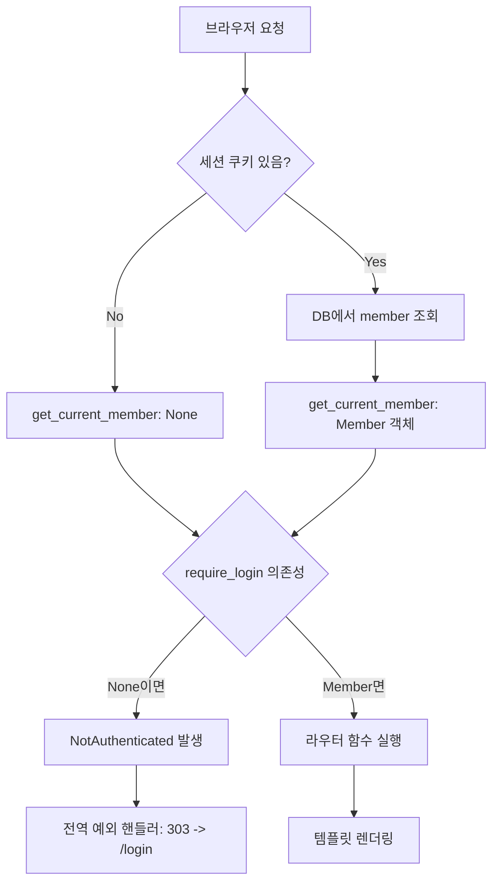
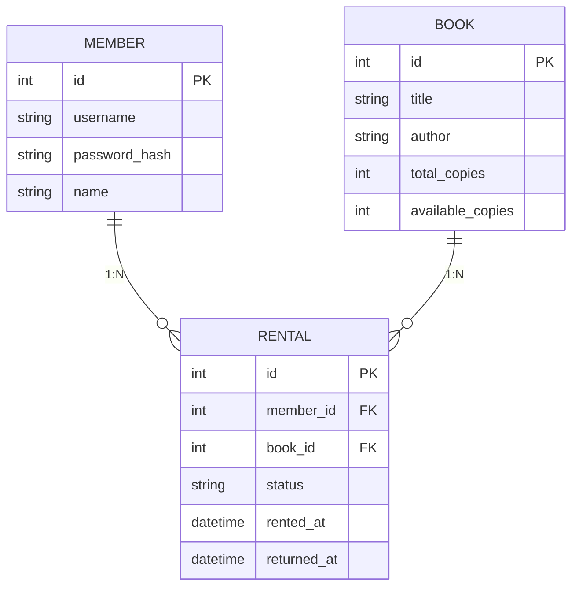
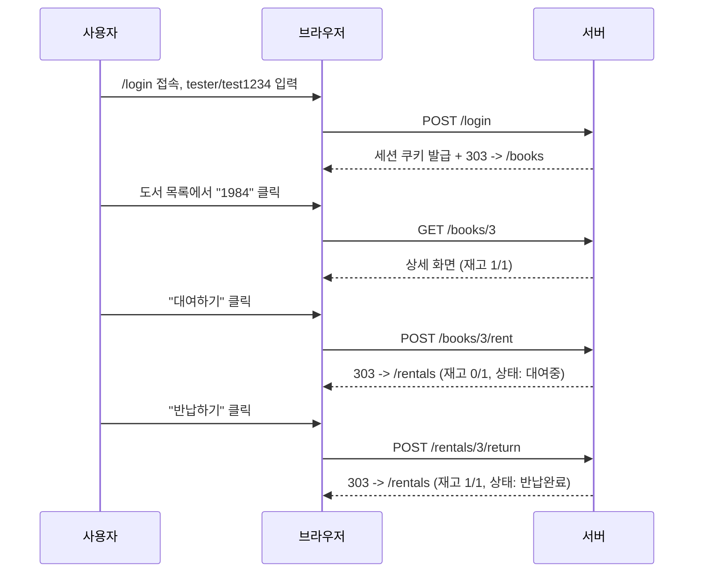
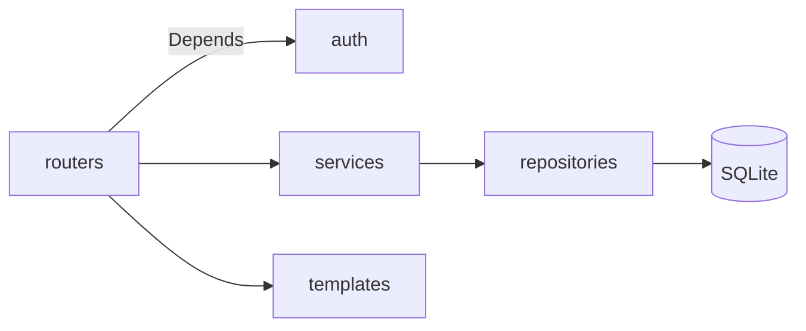

# 도서 대여 서비스 구조 분석 문서 (구술 평가 대비)

## 프로젝트 개요

로그인한 회원만 도서를 대여/반납할 수 있는 FastAPI SSR 앱이다. b5-2가 "CRUD 하나 잘 굴러가게
만들기"였다면, 이번엔 그 위에 "누가 요청했는가"라는 질문을 하나 더 얹었다. 로그인은 기능이
아니라 게이트키퍼다 — 이 문서는 그 게이트가 코드 어디서, 어떻게 작동하는지를 구술 평가 질문
순서대로 풀어쓴 것이다.



---

# 1. FastAPI Depends 기반 인증/인가 흐름

## 핵심 코드

`app/auth/dependencies.py`:

```python
def get_current_member(request: Request, db: Session = Depends(get_db)) -> Optional[Member]:
    member_id = request.session.get("member_id")
    if member_id is None:
        return None
    return db.get(Member, member_id)


def require_login(current_member: Optional[Member] = Depends(get_current_member)) -> Member:
    if current_member is None:
        raise NotAuthenticated()
    return current_member
```

## 두 단계로 나눈 이유

`get_current_member`는 "로그인 여부를 안다"만 한다 — 홈 화면처럼 로그인 안 해도 보여줄 화면에서
`member`가 `None`이어도 그냥 렌더링하면 된다(`app/routers/pages.py`의 `home()`이 이걸 그대로
쓴다). `require_login`은 그 위에 "없으면 무조건 막는다"를 얹은 별도 의존성이다. 하나로
합쳤다면 공개 페이지에서도 강제로 로그인 화면으로 튕기게 되어 버린다. FastAPI의 `Depends`는
이렇게 의존성을 체인으로 엮을 수 있어서(`require_login`이 내부에서 `get_current_member`를
다시 `Depends`로 요청), 같은 세션 조회 로직을 두 번 짜지 않고도 "선택적 로그인 확인"과
"필수 로그인 확인"을 분리할 수 있었다.

## 인증(Authentication) vs 인가(Authorization)

- 인증: "이 요청을 보낸 사람이 tester라는 계정이 맞는가" → `authenticate()`가 비밀번호를 검증하는
  순간(`app/services/auth_service.py`).
- 인가: "tester가 `/books`에 접근해도 되는가" → `require_login`이 세션에 `member_id`가 있는지
  확인하는 순간.

이 둘을 한 함수에 몰아넣으면 "로그인은 됐는데 이 페이지는 못 본다" 같은 세밀한 정책을 나중에
추가하기 어려워진다. 이번 과제는 로그인/비로그인 두 단계뿐이라 인가 로직이 단순해 보이지만,
구조 자체는 나뉘어 있다.

---

# 2. 비로그인 요청이 차단되는 지점

## 실제 흐름 (코드 기준)

`app/routers/books.py`의 `list_books`:

```python
@router.get("")
def list_books(
    request: Request,
    db: Session = Depends(get_db),
    current_member: Member = Depends(require_login),
):
```

`current_member: Member = Depends(require_login)` — 타입 힌트가 `Optional`이 아니라 `Member`인
게 포인트다. FastAPI는 라우터 함수를 실행하기 **전에** 모든 `Depends`를 먼저 해석한다. 그
과정에서 `require_login`이 `NotAuthenticated`를 던지면, `list_books` 함수 본문은 아예
실행되지 않는다. 즉 차단은 라우터 코드 안이 아니라 **라우터에 진입하기 직전**, FastAPI의
의존성 해석 단계에서 일어난다.

## 던져진 예외가 리다이렉트로 바뀌는 곳

`app/main.py`:

```python
@app.exception_handler(NotAuthenticated)
async def handle_not_authenticated(request: Request, exc: NotAuthenticated):
    return RedirectResponse(url="/login", status_code=303)
```

`require_login`은 "누가 봐도 예외 상황"을 그냥 파이썬 예외로 던지고, 그걸 사용자 친화적인
303 리다이렉트로 바꾸는 책임은 전역 핸들러에 넘긴다. 덕분에 보호 라우터가 8개로 늘어나도
`Depends(require_login)` 한 줄만 붙이면 되고, "차단됐을 때 어디로 보낼지"는 `main.py` 한
군데만 고치면 된다. 라우터마다 `if not member: return RedirectResponse(...)`를 반복해서
써야 했다면, 리다이렉트 대상 URL이 바뀔 때 8곳을 다 고쳐야 했을 거다.

실제로 테스트 계정 없이 `/books`에 접속하면:

```
GET /books  ->  303 See Other, Location: /login
```

`test_app.py`의 첫 번째 검증이 정확히 이 지점이다.

---

# 3. SQLAlchemy 연관관계를 왜 이렇게 매핑했는가

## 스키마



`Rental`은 "회원이 어떤 책을 언제 빌렸는가"라는 사실 하나를 표현하는 테이블이라, 회원 쪽과
도서 쪽 양쪽에서 다 필요한 조인 테이블 성격을 가진다. `Member`에 "빌린 책 목록"을, `Book`에
"이 책을 빌린 기록들"을 각각 컬럼으로 두면(예: 콤마로 구분한 book_id 문자열) 조회할 때마다
파싱을 해야 하고 무결성도 보장이 안 된다. `Rental`을 독립 테이블로 분리하고 양쪽에서
`relationship`으로 참조하면 "member.rentals", "book.rentals" 양방향 접근이 모두 SQL JOIN으로
자연스럽게 풀린다.

## `relationship` + `back_populates`를 쓴 이유

```python
# Member
rentals = relationship("Rental", back_populates="member")

# Book
rentals = relationship("Rental", back_populates="book", cascade="all, delete-orphan")

# Rental
member = relationship("Member", back_populates="rentals")
book = relationship("Book", back_populates="rentals")
```

`back_populates`는 관계의 양쪽을 명시적으로 서로 연결한다. `rental.book.available_copies -= 1`
처럼 객체 그래프를 따라가는 코드(`rental_service.return_book`)를 쓸 수 있는 게 이것 덕분이다.
`ForeignKey`만 걸어도 DB 레벨 무결성은 유지되지만, 파이썬 객체에서 `rental.book`으로 바로
못 넘어간다 — 매번 `db.query(Book).filter(Book.id == rental.book_id).first()`를 써야 한다.
`relationship`은 이 조회를 SQLAlchemy가 대신 해주는 것뿐이고, `back_populates`는 그 관계가
"단방향이 아니라 양방향"이라는 걸 SQLAlchemy에 알려주는 설정이다.

## cascade 정책 (왜 다르게 정했는가)

- `Book.rentals`: `cascade="all, delete-orphan"` — 책 레코드가 삭제되면(예: 오탈자로 잘못
  등록된 책 정리) 그 책에 딸린 대여 기록은 참조할 대상이 없어져 의미가 없다. 고아 레코드를
  남기지 않기 위해 함께 지운다.
- `Member.rentals`: cascade 없음 — 회원을 삭제해도 "누가 언제 이 책을 빌렸다"는 사실 자체는
  감사 기록으로서 가치가 있다(이 앱엔 회원 삭제 기능이 없지만, ORM 레벨 정책은 실무에서
  회원 탈퇴 기능이 붙을 걸 가정하고 미리 정해둔 것이다). 대여 기록까지 같이 지워버리면
  "이 책이 왜 반납 안 됐지?"를 나중에 추적할 방법이 없어진다.

---

# 4. "상태 변경 로직"이 왜 중요하고 어디에 두었는가

## 단순 CRUD와 무엇이 다른가

CRUD는 "레코드 하나를 만들고/읽고/고치고/지운다"로 끝난다. 반납 처리 하나만 봐도 실제로는
두 테이블이 동시에 바뀐다:

```python
def return_book(db: Session, member: Member, rental_id: int) -> Rental:
    rental = rental_repository.get_or_404(db, rental_id)
    if rental.member_id != member.id:
        raise DomainNotFound(f"대여 기록(id={rental_id})을 찾을 수 없습니다.")
    if rental.status == STATUS_RETURNED:
        return rental          # 이미 반납된 건 다시 반납 처리하지 않는다(멱등)

    rental.status = STATUS_RETURNED
    rental.returned_at = datetime.utcnow()
    rental.book.available_copies += 1
    db.commit()
    db.refresh(rental)
    return rental
```

`Rental.status`가 바뀌는 동시에 `Book.available_copies`도 바뀐다. 이걸 "단순 UPDATE 한 줄"로
보면 안 되는 이유는, 두 값이 항상 같이 맞아떨어져야 하기 때문이다 — 대여중인 `Rental` 개수와
`total_copies - available_copies`가 어긋나면 재고 시스템 자체가 거짓말을 하게 된다. 그래서 이
로직은 라우터(`app/routers/rentals.py`)가 아니라 서비스 계층(`rental_service.py`)에 있다.
라우터가 "요청을 받았다"는 사실만 처리하고, "그 요청이 일어났을 때 시스템 상태가 어떻게
바뀌어야 하는가"는 서비스가 책임진다는 layered architecture의 원칙을 그대로 따른 것이다.

## 소유권 검증도 여기서 한다

`rental.member_id != member.id` 체크가 라우터가 아니라 서비스에 있는 것도 같은 이유다. "남의
대여 기록을 반납 처리할 수 없다"는 것도 비즈니스 규칙이지, 단순 데이터 접근 규칙이 아니다.
403 대신 404(`DomainNotFound`)를 던지는 것도 의도적이다 — "권한이 없다"고 알려주면 그 ID의
대여 기록이 존재한다는 사실 자체를 공격자에게 흘리게 된다. 존재 자체를 감추는 게 더 안전하다.

---

# 5. 전체 구조 — 사용자 관점 vs 개발자 관점

## 사용자가 겪는 흐름



## 개발자가 보는 흐름 (레이어 순서)



라우터는 "요청을 해석하고 응답 형식(리다이렉트/템플릿)을 고른다"만 한다. 인증 여부는
`Depends`로 auth 모듈에 위임하고, 비즈니스 규칙(재고 확인, 상태 전이, 소유권 검증)은 services에
위임하고, DB 접근은 repositories에만 있다. 이 분리 덕분에 "도서 목록 화면을 카드 UI로
바꾼다" 같은 변경은 템플릿과 라우터만 건드리면 되고, "대여 정책을 바꾼다"(예: 1인당 최대
3권) 같은 변경은 `rental_service.py` 한 곳만 건드리면 된다 — 어느 파일을 열어야 할지가
요청의 성격만 보고도 예측 가능하다는 게 이 구조의 실질적인 이득이다.
